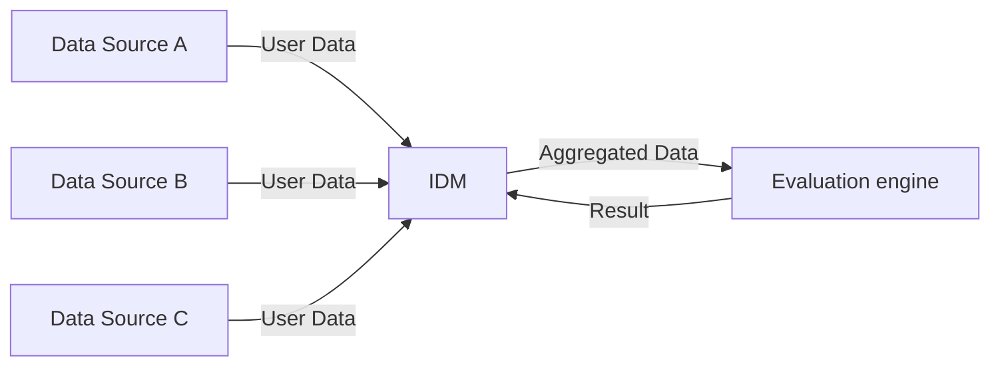

## Background

Identity management is often far more complex in practice than it seems in theory. 
Simple user journeys quickly become convoluted when edge cases and exceptions are taken into account. 
This complexity is further amplified when identity management is being introduced for the first time 
in an organization, where a lack of standardization, identity silos, and poor data quality often 
present significant obstacles.

In many cases, organizations have multiple identity stores tied to different applications, 
making it difficult to establish a unified view of the user. The process of generating a 
"golden record" — a single, unique, and well-defined user record compiled from various fragmented 
sources — becomes a daunting technical challenge. This complexity is exacerbated when business rules 
are not clearly defined upfront and need to be discovered and implemented during the process. 
Additionally, data quality is frequently compromised due to legacy systems and the natural erosion of 
information over time.

Given these challenges, it is crucial to implement a robust and flexible identity management system 
capable of accommodating complex business rules. The system should use an approach that is both technically 
sound and easy to understand, minimizing issues during the translation of business logic into code. 
Furthermore, changes to these business rules should not necessitate a full software development lifecycle, 
but rather be managed as configuration changes, enabling faster and more adaptable updates.


In this article, I explore a solution implementing centralized policy decision point 
based on open-source components for just-in-time user registration. 
Please note that this is not intended as an evidence-based evaluation but rather a description of what 
worked for me in solving this problem, and it may help you as well. The approach outlined below uses 
Open Policy Agent (OPA) as a policy engine and has been successfully deployed in production for some time.


## Goals

First, let's enumerate the goals for the system:

### Fundamental

B1. The solution needs to be production ready and verified in a real-world scenario.

B2. We don't have unlimited budget, so the solution should be cost-effective, easy to maintain and modify.

### Functional

F1. Encapsulate business logic in a separate component with easy interface.

F2. Enable complex logic on user attributes and relations between them. 

F3. Fast JIT decision what actions identity management system should take (e.g., deny the process). 

F4. Generate data modification instructions for the identity management system.

F5. Standardised way of defining rules, which can be extended with other use cases if needed.

### Usability

U1. Business (a.k.a non-technical employees) can understand the logic of the policy 
and even define their own rules.

U2. Developers can understand the process and does not have to translate business requirements into code.

U3. It is easy introduce changes to the rules and intergrate with existing IDM stack.

U4. Versioning following GitOps principles

## Design

The high-level design of the solution is as follows:
1. IDM aggregates data from various sources.
2. IDM creates a data bundle that represents the user.
3. Bundle is sent to the evaluation engine.
4. Evaluation engine uses the rules to make a decision.
5. Evaluation engine returns the decision and actions to IDM.

The diagram below shows the high-level design of the solution:



## Proposed Solution

Having previous experience with [OPA](https://www.openpolicyagent.org/docs/latest/) (Open Policy Agent) for access management,
my idea is to try to use it for the user registration process.

OPA allows to evaluate policies which encode business logic using [rego language](https://www.openpolicyagent.org/docs/latest/policy-language/).
OPA executes declarative policies completely decoupled from the application code. Any party in your system can
simply trigger a REST call to OPA engine with input data for evaluation.   

For example, below is a sample of a simple policy that checks access policy for API calls to the HTTP server 
(source [OPA documentation](https://www.openpolicyagent.org/docs/latest/http-api-authorization/#steps)):

```rego

package httpapi.authz

import rego.v1

# bob is alice's manager, and betty is charlie's.
subordinates := {"alice": [], "charlie": [], "bob": ["alice"], "betty": ["charlie"]}

default allow := false

# Allow users to get their own salaries.
allow if {
	input.method == "GET"
	input.path == ["finance", "salary", input.user]
}

# Allow managers to get their subordinates' salaries.
allow if {
	some username
	input.method == "GET"
	input.path = ["finance", "salary", username]
	subordinates[input.user][_] == username
}
```

In this example based on the request metadata, OPA engine makes decision to allow or deny access to the resource.

For example, the data as shown below sent for the evaluation will result with result `true`.
```json
{
  "method": "GET",
  "path": ["finance", "salary", "alice"],
  "user": "alice"
}
```

This can be easily extended to the user registration process to decide if user should be registered or not. 
What about the actions that should be taken by the IDM system? OPA can help with that as well.
Instead of returning just `true` or `false`, the engine can return a complex JSON object that is constructed accordingly
to the rules which I show in the [implementation section](#implementation).


## Alternatives

Before selecting OPA, I evaluated the approaches of building the rules engine from scratch as 
a native extension of the identity management system as well as using BPMN engine such as 
[Camunda Zeebe](https://camunda.com/platform/zeebe/).

While native implementation is tempting with its flexibility, performance and 
tight integration with the IDM system, it fails to deliver on the usability side.
Source code typically mixes business logic with language specific constructs, 
making it hard to understand for non-technical (and sometimes technical) employees.
On top of that, designing and implementation of the rules engine is a significant development effort increasing the cost of the solution.

My first thought of viable solution that binds business logic and technical implementation was to use [BPMN](https://www.omg.org/spec/BPMN/2.0/) engine.
BRPN (Business Process Model and Notation) defines an XML-based 
representation of the business flow and binds it with software executions.
Importantly, the flow design can be defined in the graphical editor without knowing
the underlying technology. 
While this approach might have worked, I found it too high-level for the task at hand.
In my use case the logic needs to evaluate every single field of the user and make the decision.
It would mean that steps of the BPMN had to be very granular which decreses performance 
(each one calls method in the BPMN worker) or the logic would have to be implemented in the worker which 
is very close to the native implementation.

## OPA for the rescue

Let's start with the evaluation of the requirements.
OPA is definitely production-ready and tested by many companies (B1).
The open-source version is sufficient for this use case, and the running cost is relatively [small](https://www.openpolicyagent.org/docs/latest/policy-performance/#resource-utilization).
The policy is defined as a text file and can be modified in any editor (B2). This completes our fundamental requirements.

Regarding functional requirements, Rego files contain the entire business logic.
The Rego file is evaluated in the OPA engine, a separate component (e.g., a Docker container) with a clear REST API.
To get a policy decision, literally one REST API call is needed, so we have F1 covered.

In the case of F2, the Rego language is powerful; however, I must admit that, with a typical software development 
mindset (i.e., writing step-by-step instructions to achieve results), defining the rules might not feel intuitive. 
For example, there are no for loops in Rego, and if statements are declared differently than what you might be 
familiar with in popular languages like Java or JavaScript (see more in [rego design principles](https://blog.openpolicyagent.org/rego-design-principle-1-syntax-should-reflect-real-world-policies-e1a801ab8bfb)).
However, thanks to this design, complex policies with broad and deep execution paths can be described concisely.
Conditions between static data, input data, and dynamically calculated data can be easily defined.
One drawback from my experience with Rego is that it is not a full-fledged programming language, and some 
operations available by default or through native libraries are missing. 
For example, simple geofencing calculations require basic mathematical operations like sine and cosine, 
which are not available in Rego. However, you can extend the Rego engine by writing Go code and [extending the OPA engine](https://www.openpolicyagent.org/docs/latest/extensions/). 
Alternatively, in my case, I queried an external service for the result using OPA's HTTP client.
Therefore, I believe that the requirement F2 is sufficiently met.

F3 is a strong point of OPA. The engine is very fast and can evaluate policies in a fraction of a second.
For our complex policy (with over 2,000 lines of code), the evaluation time is between 2-4ms.
Though this is not a benchmark result suitable for OPA performance comparisons, the outcome is far better than required for our use case, so F3 is met.

OPA policies are not limited to returning a single boolean value. They can return a complex JSON object.
With that, you can use policy rules to construct a JSON object that orchestrates actions to be taken by the IDM system.
Actions like modifying a user's email in Active Directory or updating contact information in the CRM system can be easily defined.
In my case, OPA rules were used to construct LDAP LDIF files that were later executed by the IDM system.
Therefore, F4 is met.

Making complex rules simple is a challenge, and regardless of the technology, one can end up with spaghetti code.
However, Rego has the advantage of flattening the logic and promoting the creation of short blocks that represent policy conditions.
This contributes to the readability and standardization of rule definitions. Regarding extensibility, once created, a policy can be easily extended—up to the point that it breaks the agreed interface with the client (e.g., a new field in the response).
But even then, the change is easy to introduce and does not require much effort.
Therefore, F5 is met.

Now let's look at usability.
To my surprise, OPA was easy to understand for the business. Once rules are named in understandable language (e.g., is_user_in_hr_group), the rule and entire policy become more like a recipe than code.
I found that after initial training, non-technical employees were able to understand the policy and even define their own rules.
Therefore, in my opinion, U1 is met.

Easily understandable but technical representations of policy rules also benefit the development side.
Business requirements, typically delivered as a set of plain English-described conditions, are much easier to translate into Rego code than into native code.
The reverse is also true: once requirements are expressed in Rego, it is easier to perform reverse reasoning and understand the business logic.
Therefore, U2 is met.

Regarding U3, I have already discussed policy updates and integration via a single REST call.
In terms of versioning (U4), rego files are text files that can be easily versioned using Git.

### Implementation examples

1. The policy has single entrypoint. A rule called decision that is being called via REST API.
This rule defines the structure of the response and calls other rules to evaluate the decision.

Example:
```rego
decision := response {
    response :=
    {
        "ruleImplemented":rule_implemented,
        "input": policy_input,
        "ldap": ldap,
        "error": error,
        "warn": warn,
        "metadata": metadata,
        "version": policy_version,
        "timestamp": time.format(time.now_ns())
    }
}
```

2. The policy also runs the check of the data quality. If something is wrong the
warning message is added to the response. Similar approach is done for errors.

Example
```rego
warn[warn] {
	user_is_in_ldap
	count(ldap_attribute_x) == 0
  warn := "MISSING_LDAP_ATTRIBUTE_X: LDAP data is missing the x attribute"
}
```

3. Creating ldif entry

```rego
ldap := ldap_recs {
	ldap_recs := {
		"roles":[{
			"dn": "cn=member,ou=roles,dc=example,dc=com",
			"changetype": "modify",
			"add": "member",
			"member": concat(",",[concat("=",["uid",input.username]),"ou=users,ou=external,dc=example,dc=com"])
		}]
	}
}

```


## Summary

In this article, I showed one way to use OPA to implement a centralized policy evaluation for
just-in-time user registration process. The solution is production-ready, cost-effective, and easy to maintain and modify.
Naturally, the solution can be extended to other use cases, on which I am currently working.

The key takeaways are that OPA and rego language, despite the initial learning curve, are powerful tools for implementing complex business logic.
Another observation is that policy decision is not the only thing that can be returned by the OPA engine.
Finaly, I believe that the simplicity of the syntax of rego combined with well designed naming conventions 
can drasticly reduce friction and misunderstandings between business requirements and technical implementation.


NExt secret zero
